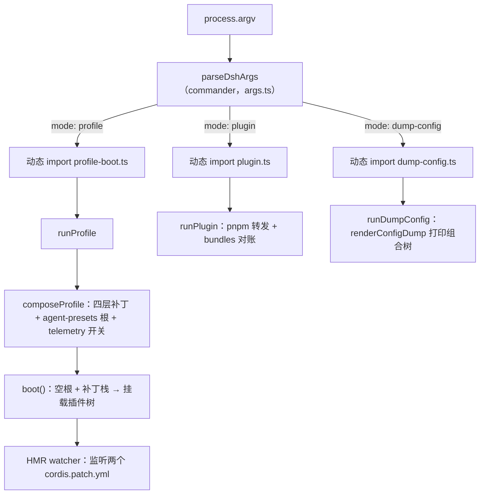

# apps/cli 源码实现解析

本文是 `apps/cli` 全部代码的学习向实现参考：从命令行参数如何被解析，到 profile 如何被组装成插件树并启动，再到进程如何退出。官方行为契约见 [reference/README.zh.md](reference/README.zh.md)（命令模式、参数边界、部署默认值），[README.zh.md](README.zh.md) 是入口概览；本文只讲实现逻辑，不重复行为参考里的用户文档。

## 0. 包定位与文件地图

`apps/cli` 是包 `@deepseek-ai/dsh`，安装后提供 `dsh` 命令（[package.json](package.json) 的 `bin` 字段指向构建产物 `lib/bin.js`）。它的职责边界非常窄：解析命令行、解析并启动 profile、把 pnpm 转发给 profile 目录、打印组合后的配置树。插件树的真正组装与运行全部委托给 `@deepseek-ai/dsh-app-boot`（见 [packages/boot/app-boot](../../packages/boot/app-boot/README.md)），CLI 只负责“启动前的所有事”和“进程级生命周期”。

| 文件 | 职责 |
| --- | --- |
| [src/bin.ts](src/bin.ts) | 进程入口：读版本、解析 argv、按 mode 动态导入唯一的 runner |
| [src/args.ts](src/args.ts) | Commander 语法：launcher flag 边界、`web` 别名、`plugin` 转发、config dump 路由 |
| [src/profile-boot.ts](src/profile-boot.ts) | 共享启动器：补丁分层、`boot()`、信号、fail-loud、HMR 热重载 |
| [src/process-shutdown.ts](src/process-shutdown.ts) | 有界、可升级的进程退出控制器 |
| [src/plugin.ts](src/plugin.ts) | pnpm 转发 + `dsh.profile.bundles` 对账 |
| [src/dump-config.ts](src/dump-config.ts) | 不启动的配置树打印 |
| [config/agent-presets/](config/agent-presets/) | 随附的 4 个 agent preset（standard / code / cordis / minimal） |
| [tests/](tests/) | 单元测试、构建产物 e2e、兼容与快照测试 |
| [composition.md](composition.md) | 生成的 dsh-base 组合图（由 `scripts/gen-doc-graphs.ts` 生成，勿手改） |
| [package.json](package.json) / [tsconfig.json](tsconfig.json) / [tsdown.config.ts](tsdown.config.ts) | 包清单、类型构建、产物打包 |

### 一次调用的总链路



### 核心设计原则

- **launcher 与 app 分层**：`dsh` 只解析自己的 flag，第一个不认识的 token 之后全部原样交给被启动的 app；app 通过 `ctx.cmdlineArgs` 读取同一份不可变参数快照。
- **按 mode 动态导入**：`bin.ts` 只 `switch` 三个 mode，每个 mode 才 `import()` 自己的 runner，无关代码不进分发路径。
- **一切皆补丁层**：profile 配置树永远挂在空根 `[]` 之上，内容全部来自有序叠加的补丁层。
- **失败必须大声**：配置错误、补丁解析错误、插件启动失败都以带标签的诊断和退出码终止，绝不静默跳过。
- **进程生命周期有界**：优雅关闭限时 5 秒，重复信号立即强制退出。
- **源码/构建双布局**：所有锚点（`INSTALL_ANCHOR`、`SHIPPED_PRESET_ROOT`）用 `import.meta.url` 相对定位，`src/` 与 `lib/` 同样适用。

## 1. src/bin.ts 入口分发

`bin.ts` 是 `dsh` 的进程入口，核心逻辑只有三步：读版本、解析 argv、按 mode 分发。

版本号从 [package.json](package.json) 读取：`new URL('../package.json', import.meta.url)`。源码布局下是 `apps/cli/src/../package.json`，构建布局下是 `apps/cli/lib/../package.json`，两个锚点都落在同一个清单上，因此源码入口和安装后的内置 bin 共用同一套相对定位。

```text
const invocation = parseDshArgs(process.argv.slice(2), readVersion())
```

`parseDshArgs` 来自 [args.ts](src/args.ts)，它已经替进程处理了 help、version 和解析错误（内部 `process.exit`），所以返回的一定是合法 invocation。`bin.ts` 随即 `switch (invocation.mode)`：

- `profile`：动态 `import('./profile-boot.ts')`，调用 `runProfile({ environment: loadLayeredEnv('dsh'), profile, patchFiles, args })`。`loadLayeredEnv` 在分发阶段就构建启动环境快照（详见第 8 节），然后 `runProfile` 负责全部启动工作，`bin.ts` 不再接管。
- `plugin`：动态 `import('./plugin.ts')`，`process.exit(runPlugin(...))`。这是一个同步模式，直接以 pnpm 的退出码结束进程。
- `dump-config`：动态 `import('./dump-config.ts')`，`runDumpConfig(...)` 同步打印后自然结束。
- `default`：`invocation satisfies never` 后抛错。`satisfies never` 让 TypeScript 在这个穷尽 switch 上做完整性检查：新增 mode 却忘记分支会直接编译失败。

`/* v8 ignore file */` 的注释说明该文件的真实行为由 `built-bin` 验收测试驱动（[tests/built-bin.e2e.ts](tests/built-bin.e2e.ts)），单测不重复覆盖。

## 2. src/args.ts 命令行语法

### 2.1 参数边界语义

整个文件最重要的设计是“launcher flag 在前，app 参数在后，边界是第一个 launcher 不认识的 token”。Commander 配置中 `helpOption(false)`、`allowUnknownOption()`、`passThroughOptions()`、`enablePositionalOptions()` 四者组合实现这一点：launcher 没有自己的 `-h`（`-h` 是 app 的），遇到未知选项不停报错，而是放进 `[args...]` 位置参数。

```text
dsh --profile web --port 8080    → --port 8080 交给 web app
dsh --profile web -h             → 打印 web app 的帮助，不是 launcher 的
dsh -h                           → 没有 profile 可交付，打印 launcher 自己的帮助
dsh --profile tui --resume abc   → --resume abc 原样到达 app
```

两个边界细节：

- `dsh --profile x --patch a.yml --resume b --patch late.yml`：launcher 的 `--patch` 收集器在遇到 `--resume`（第一个未知 token）后停止，所以只收集到 `a.yml`，`--patch late.yml` 连同 `--resume b` 一起成为 app 参数。
- 第一个 app 参数恰好是 `web` 或 `plugin` 时，Commander 会把它当作子命令处理（`dsh --profile x web` 因此报错），所以 launcher 说“第一个 app 参数等于 web/plugin 会选中子命令”；需要字面量 `--` 送达 app 时写成 `-- --`。

### 2.2 Commander 配置逐项说明

- `.exitOverride()`：把 help/version/error 变成抛出的 `CommanderError`，由 `parseDshArgs` 的 `try/catch` 统一 `process.exit(error.exitCode)`，单测可以捕获退出码。
- `.helpOption(false)`：禁用 launcher 自带的 `-h/--help` 选项，因为 `-h` 归 app 所有。裸 `dsh -h` 没有 app 可交付，action 里检测到 args 含 `-h/--help` 时手动 `program.help()`。
- `.allowUnknownOption()`：未知选项不报错，进入位置参数。
- `.passThroughOptions()`：launcher 选项之后不再尝试解析未知选项。
- `.enablePositionalOptions()`：位置参数之后出现的选项也归 app。
- `.argument('[args...]')`：剩余 token 全部收进 `args`。
- `.option('--profile <name>')`、`.option('--patch <path>', ..., collect)`：`collect` 是可重复的单值收集器，**故意不是 variadic**，否则 `--patch a.yml --resume b` 会把 `--resume b` 也吞进 patch 列表。
- `.version(version, '-V, --version', ...)`：版本选项在参数边界之前出现时打印 launcher 版本并退出 0。

### 2.3 三个命令形态

**默认命令（`dsh --profile <name>`）** 的 action 先校验：没有 `--profile` 时报错（除非 args 里带 `-h/--help` 走 help）；`--profile ''` 报错。然后 `resolveBoot`：

- `--patch` 列表含空字符串时报错（`--patch=`）。
- `--dump-config` 与 `--dump-default-config` 互斥。
- 任一 dump 模式携带 app 参数时报错：dump 不运行 app 的 cmdline provider，无法展示参数决定的结果，打印一棵与真实 boot 不同的树会误导。
- `--dump-default-config` 与 `--patch` 互斥（默认 dump 只打印 bundle 层）。

**`web` 子命令** 是 `--profile web` 的硬编码别名，拥有自己的 `--patch/--dump-config/--dump-default-config` 选项（没有 `--profile`），action 里先 `rejectParentOptions('web')`：如果父命令上带了 `--profile/--patch/--dump-*`，说明参数放错了位置，直接报错。其余走同一个 `resolveBoot(web, 'web', ...)`。

**`plugin` 子命令** 要求 `--profile`，转发 `[args...]` 给 pnpm；没有可转发的参数时报错。它也拒绝父命令选项。

`parseDshArgs` 的 catch 把任何解析失败转成退出码：`CommanderError` 用其 `exitCode`（help 0、error 1），其它异常退出 1。action 必定给 `resolved` 赋值或抛出，`switch` 之后若 `resolved` 仍是 `undefined` 则抛内部错误。

## 3. src/profile-boot.ts Profile 启动核心

这是整个 CLI 最核心的文件：把“一个 profile 名字”变成“一棵正在运行的 Cordis 插件树”，并且管好热重载、信号和退出。

### 3.1 常量

| 常量 | 值 | 作用 |
| --- | --- | --- |
| `NAME` | `'dsh'` | 所有诊断前缀 |
| `INSTALL_ANCHOR` | `apps/cli/package.json` | 安装锚点，bundle 解析与模块回退都从它开始 |
| `SHIPPED_PRESET_ROOT` | `apps/cli/config/agent-presets/` | 随附 agent preset 的系统根目录 |
| `TELEMETRY_ROW_ID` | `'session-telemetry-otel'` | telemetry 开关针对的行 id |
| `PROFILE_ROOT_FILENAME` | `'cordis.yml'` | profile 目录内的根配置文件 |
| `PROFILE_ROOT_CONFIG` | 空 entry 列表 + 注释 | 每个 profile 树打补丁的空根 |

### 3.2 三个小工具函数

`homePatchPath()` 返回 `$DSH_HOME/cordis.patch.yml`，每次调用时解析而非模块加载时解析，因为 `DSH_HOME` 可能由测试或 launcher 在 import 之后设置。

`resolveTelemetryPatch(disabledEnv, hasRow)` 把 `DSH_TELEMETRY_DISABLED` 环境变量翻译成补丁 `{ id: TELEMETRY_ROW_ID, disabled: true }`。语义：任何非空值都禁用（包括 `'0'`/`'false'`），隐私开关倾向误关而不是误开；组合里没有 telemetry 行时无需补丁（自定义 profile 不挂 telemetry 也能跑）。

`prepareProfile(name, userLayer = true)` 三步：

1. `healProfilesModuleFallback(INSTALL_ANCHOR)`：维护 `$DSH_HOME/profiles/node_modules` 的符号链接闭包（详见第 8 节）。
2. `loadProfile(...)`：解析 profile 目录，把 `dsh.profile.bundles` 里的每个 bundle 解析成补丁层，读 profile 自己的 `cordis.patch.yml`（`userLayer: false` 时跳过，供默认 dump 使用）。
3. **重写根配置**：把 `cordis.yml` 写回空数组。原因：Loader 的树写回（插件自销毁时持久化当前树）可能把组合后的行烤进这个文件，下次启动就会重复插入每个 bundle；根文件存在只是因为 Loader 需要一个真实 include 根来锚定 profile 目录的 `baseUrl`，配置 dump 也锚定同一文件，保证两者在相同基础上组合。

### 3.3 composeProfile：组装补丁栈

`ComposedProfile` 把补丁分成四组，应用顺序（后层覆盖前层）：


`composeProfile` 的步骤：

1. `prepareProfile(name)` 加载 profile。
2. `homePatches = loadOptionalPatches(NAME, homePatchPath()) ?? []`：home 层是**可选**的，文件不存在等于没有这层。
3. `overlays = patchFiles.flatMap(file => loadOverlayPatches(NAME, resolve(file)))`：`--patch` 是**必选**文件，缺了直接抛错（调用者点名了这个文件，缺失是配置错误）。
4. `bundlePatches = profile.layers.flatMap(layer => layer.patches)`。
5. `composeEntries([bundlePatches, profile.patches, homePatches, overlays])` 把所有层合成最终 entry 行，构建 `id → EntryOptions` 的 `rows` 索引，供 launcher 自己做行检查。
6. `agent-presets` 特殊处理：只有组合里已有 `agent-presets` 行（web profile）时，追加一个覆盖层，把 `SHIPPED_PRESET_ROOT` 以 `trust: 'system'` 挂进 `roots`。随附根是只有本 app 才能解析的路径；用户自己的 preset 由 `dsh-agent-presets` 的默认可写根（`$DSH_HOME/.agent-presets`）负责。
7. 追加 telemetry 禁用补丁。

`allPatches(composed)` 就是把四组按序摊平，供 boot 一次性使用。

### 3.4 runProfile：端到端启动

`runProfile(options)` 的完整流程：

**第一步，创建退出控制器。** `createProcessShutdown(async () => { await app.current?.fiber.dispose() })`。dispose 回调通过 `app.current` 间接引用树，因为 `boot()` 返回之前 `ctx` 还不存在，而信号可能在启动窗口内随时到达。`app.current` 在 `boot()` 的 prepare 回调里先指向 host context，`boot()` 返回后再指向最终 ctx。

**第二步，注册信号与 fail-loud。** `interrupt(code)` 先 `signalShutdown.abort()`（记录“正在退出”这一事实），再 `shutdown.interrupt(code)`。`SIGTERM` → 0（监督者的常规停止请求，launcher 不知道 app 是否认为工作已完成），`SIGINT` → 130（用户中断）。`installFailLoud(NAME, process, release)` 安装 `unhandledRejection` 处理器：启动后期某个插件初始化 reject 时，打印带标签的致命诊断并 `exit(1)`；`release` 先销毁整棵树，给 terminal 持有者最多 2 秒恢复 raw mode 的窗口（详见第 8 节）。

**第三步，定义实时重组合回调 `composeLive`。** 热重载时新鲜读取 profile 层和 home 层当前内容，夹在 bundle 层（下）与 overlays（上）之间。两个关键点：

- 每代 `structuredClone`：include 把 `insert` 行按引用推进已挂载的树，之后的 id 定位补丁会原地修改这些对象；复用同一份解析结果会把用户覆盖永久烤进 bundle 的内存插入行，删掉覆盖也无法恢复默认。
- 两个文件都新鲜读取，而不是只信 watcher 交来的变更补丁：两个 watcher 各读各的，避免互相拼接对方的过期副本。

**第四步，`boot()` 启动。** `boot(NAME, rootConfig, structuredClone(allPatches(composed)), prepare)` 来自 `dsh-app-boot`：新建 Context → 设置 `baseUrl` → 装 Loader → 运行 prepare（此时任何 entry 都没挂载）→ 挂载根 include 并应用补丁 → 等待 entry 激活并审计失败。启动失败时销毁半成品树，抛带最深层 cause 堆栈的标签化错误。

prepare 回调注入两个 launcher 事实：

- `launchEnvironment`：启动环境的冻结快照，插件从这里解析所有启动时环境值，保证来源一致且不可变。
- `cmdlineArgs`（不可变参数快照）与 `appExit`（`code => shutdown.shutdown(code)`）：任何注入参数快照的 app 插件都能读参数、请求有界退出。这就是“app flags 不是 launcher 职责”的落点。

**第五步，配置热重载。** 树还活着时（信号未中止、fiber ACTIVE、Loader 在场）：

- 组合里没有 `hmr` 服务时补装 `timer` + `hmr`，配置 `root: []`（只监听配置、不监听模块）——web bundle 禁用了共享的模块重载行（其重载生命周期未经测试），而 `cordis.patch.yml` 的编辑必须在所有长生命周期界面上实时生效，静默跳过会破坏文档承诺的热重载契约。
- 对 profile 层和 home 层各调 `watchUserPatches(ctx, { filename, compose: composeLive })`，实现事务式配置热重载。
- 任何失败先过 `suppressShutdownError`：只有“树正在按用户要求退出”（信号中止，或快速一次性 app 的 `appExit` 导致 disposal 打断了 watcher 安装）才静默放过，否则重新抛出。

**第六步，返回。** `{ ctx, shutdown }`，进程生命周期交给挂载的插件（或组合里的一次性 runner），launcher 不再接管。

## 4. src/process-shutdown.ts 进程退出控制器

这是一个“有界、可升级”的退出状态机，供所有长生命周期 CLI 界面共享。

内部状态：`pending`（正在进行的关闭 promise）、`timeout`（宽限定时器）、`completed`（自然完成已记录）、`forceExited`（已强制退出）。默认宽限 `PROCESS_SHUTDOWN_TIMEOUT_MS = 5000`，`forceExit` 默认 `process.exit`，`complete` 默认写 `process.exitCode`（都可用测试替换）。

`shutdown(code)` 的行为：

- 已有 pending 时直接返回同一个 promise（**合流**：多次正常关闭请求不会升级为强杀，第一次的 code 生效）。
- 首次调用：启动 5 秒定时器，然后 `dispose()`；dispose 成功 → `completeOnce(code)`（写 exitCode，自然退出）；dispose 失败 → `forceExitOnce(code)`；超时 → `forceExitOnce(code)`。

`interrupt(code)` 的行为：

- 没有 pending 时：启动优雅关闭，但 dispose 完成后**强制退出**（信号不等待事件循环自然排空）。
- 已有 pending 时：直接 `forceExitOnce(code)`——第二个信号就是升级为强杀。

由此得到文档承诺的行为矩阵：首次 `SIGINT/SIGTERM` 开始优雅排空（SIGTERM 退出 0、SIGINT 报告 130）；二次信号立即强杀；如果一次性正常完成已经卡在 dispose，第一次 `Ctrl+C` 就是升级，直接强杀而不是被吞掉。

## 5. src/plugin.ts 插件管理

`dsh plugin --profile <name> <args...>` 是“薄 pnpm 转发器”，流程：

1. `resolveProfileDir(profile)` 得到目录；没有 `package.json` 时 `initProfile(dir, PROFILE_TEMPLATES[profile] ?? DEFAULT_PROFILE_BUNDLES)` 初始化（web/headless 用随附模板，其它名字只装 `@deepseek-ai/dsh-base`），并打印“已初始化”。
2. 读取初始化后的 manifest 作为 `before`。
3. `spawnSync('pnpm', args.map(anchorPathSpec), { cwd: dir, stdio: 'inherit', shell: process.platform === 'win32' })`：Windows 上 pnpm 走 `.cmd` shim，`spawn` 因 CVE-2024-27980 加固拒绝无 shell 执行，所以 win32 必须 `shell: true`。
4. `ENOENT` → 提示 pnpm 不在 PATH，返回 127；其它 spawn 错误直接抛出。
5. pnpm 成功（exit 0）→ `reconcilePlugins(before, dir)`；失败 → 打印“pnpm failed in profile directory”并在参数含 git spec（`git+`、`github:`、`.git`）时附加 `allowBuilds` 提示：pnpm ≥10 默认阻止 git 依赖的 `prepare` 构建脚本，需要把 pnpm 打印的键写进 profile 的 `pnpm-workspace.yaml`。

### 5.1 anchorPathSpec：相对路径锚定

`anchorPathSpec(argument, cwd)` 用正则匹配 `.`、`..`、`./x`、`../x` 及其 `file:`/`link:` 前缀形式，把相对路径解析到**调用者所在目录**，其余参数原样通过。原因：pnpm 的工作目录是 profile 目录，`add .` 若按 profile 目录解析会自链接 profile；锚定后，在插件 checkout 里 `add .` 安装的是该 checkout。`file:` 与裸路径语义不同（pnpm 对 `file:` 和普通目录路径的 link/copy 行为不一样），所以锚定不改变用户指定的前缀。

### 5.2 reconcilePlugins：按安装状态对账

对账原则是“以安装状态为准，而不是依赖 diff”，因此 `update` 让某个包**新获得** `dsh.bundle` 声明后会自动激活它。

- `exportsPatch(packageName, profileDir)`：`resolveBundleDir` 先按安装锚点解析、再按 profile 目录解析；解析失败（pnpm 说成功但包不可解析）或 manifest 未声明 `dsh.bundle.patch` 都视为“不是 bundle”。
- 新增：每个依赖里解析为 bundle 且不在 `plugins` 里的，按依赖顺序追加进 `dsh.profile.bundles`。
- 警告：新加的依赖不是 bundle 时，打印一次性警告（普通库没问题，警告是定向说明）。
- 删除：只清理“依赖管理”的条目（曾经是依赖或当前是依赖）；随附模板 bundle（`dsh-base` 等）不是依赖，永不触碰。依赖仍在但已不再是 bundle，或依赖已移除，都从列表删除。
- 有变化才 `writeProfileManifest` 写回。

## 6. src/dump-config.ts 配置打印

`runDumpConfig(profile, defaultOnly, patches)` 是 boot-free 的组合树打印：

- `prepareProfile(profile, !defaultOnly)`：`defaultOnly` 时跳过解析 `cordis.patch.yml`，因此坏掉的用户层也不会导致默认 dump 失败（恢复诊断场景）。
- 层列表：每个 bundle 一层（label 是包名）；非 defaultOnly 时追加 profile 层（存在才加）、home 层（存在才加）、每个 `--patch` 覆盖层（必选）。
- `renderConfigDump(NAME, profile目录/cordis.yml, layers)` 读空根，用 include 的 `applyEntryPatches` 算法逐层应用，生成带来源注释的 YAML。

输出格式与语义（[packages/boot/app-boot/src/index.ts](../../packages/boot/app-boot/src/index.ts) 的 `renderConfigDump`）：

- 每个 entry 记录 `origin`（提供它的文件/层）与 `patchedBy`（按应用顺序修改过它的覆盖层），输出按“来源相同且被修改者相同”的连续段分组，注释形如 `# == 文件, patched by 覆盖层1, 覆盖层2`。
- `!!js` 表达式保持**未求值**（dump 不启动树，不可能安全求值）。
- 找不到目标的 patch 通过 `warn` 写到 stderr，带层 label。
- 每次快照都 `structuredClone` 层列表，与 boot 相同的引用隔离原因。

dump 拒绝 app 参数的原因（args.ts 已挡）：dump 不运行 app 的 cmdline provider，打印的树是“参数解析前”的组合，若参数会影响配置则与真实 boot 不一致。

## 7. config/agent-presets 随附 agent preset

`SHIPPED_PRESET_ROOT` 指向 [config/agent-presets/](config/agent-presets/)，web 组合通过 `agent-presets` 插件的 `roots` 把它以 `trust: 'system'` 挂入。每个 preset 是“元数据 + 组合文件”：

| 目录 | 模式名（preset.yml） | 实现 |
| --- | --- | --- |
| `standard/` | 标准模式（order 1） | 完整编码 agent：文件编辑、Shell、检索、Skills、计划、目标、子代理、工作流 |
| `code/` | PTC 模式（order 2） | standard + `tool-presentation`：模型用 TypeScript 程序组合多步操作，`run_code` 一次执行 |
| `minimal/` | 极简模式（order 3） | 固定完整系统提示词 + 仅持久 bash 与 `str_replace_editor` 双工具，无压缩、无运行时上下文 |
| `cordis/` | 创造模式（order 4） | standard + 自指 Cordis 工具集与组合创作技能，允许 agent 读写自己运行时的组合 |

结构上每个 preset 有 `preset.yml`（显示名、描述、排序）与 `agent.cordis.yml`（agent-plane 组合：persona、agent-instructions、工具行、`cordis:group` + `isolate` realm 分组）。`isolate: true` 表示 entry-local realm：每个会话挂载自己私有的服务实例，避免多个会话在同一 realm 注册同名服务冲突；`dsh-agent-presets` 会拒绝没有 realm 的 service 行。用户自建 preset 放在 `$DSH_HOME/.agent-presets/<id>/`，发现与健康检查由 [packages/preset/agent-presets](../../packages/preset/agent-presets/README.md) 负责。

## 8. 底层支撑（dsh-app-boot 关键机制）

CLI 自身的实现大量依赖 `dsh-app-boot`，理解这些机制才能真正读懂 `profile-boot.ts`。

### 8.1 profile 目录与模板

profile 目录（`$DSH_HOME/profiles/<name>/`）含：`package.json`（依赖 + `dsh.profile.bundles` 有序列表）、`cordis.patch.yml`（用户补丁层）、`pnpm-workspace.yaml`（`nodeLinker: hoisted`、`autoInstallPeers: false`）。`resolveProfileDir` 拒绝空名、含路径分隔符、`.`、`..`、`node_modules`。`PROFILE_TEMPLATES`：`web = [base, web-app]`、`headless = [base, headless]`；其它名字默认只有 `[base]`。`normalizeShippedProfile` 会把与安装期遗留组合完全一致的 bundle 列表重写为当前随附模板，避免升级后 profile 固化旧组合。见 [packages/boot/app-boot/src/profile.ts](../../packages/boot/app-boot/src/profile.ts)。

### 8.2 healProfilesModuleFallback：模块回退闭包

每次启动时维护 `$DSH_HOME/profiles/node_modules`：BFS 遍历安装清单的 `dependencies + peerDependencies` 闭包，为每个可达包建一个指向真实目录的符号链接。作用：patch 行里的裸插件名从 profile 目录向上做 Node 父目录查找时，profile 自己的 `node_modules` 之后就会命中这个回退目录，于是“bundle 来自安装”的契约成立，且所有插件共享同一个 Cordis 实例。幂等：正确的链接保留，移动的安装重新指向。

### 8.3 loadLayeredEnv：分层环境快照

`loadLayeredEnv('dsh')`（[packages/boot/app-boot/src/index.ts](../../packages/boot/app-boot/src/index.ts)）在分发阶段构建快照：先快照继承的 `process.env`，再解析调用目录 `.env`（项目层）与 `$DSH_HOME/.env`（用户层；home 与 cwd 相同时跳过用户层）。两个文件先解析后应用，任一解析失败都不留下半应用状态；应用时**不覆盖**已继承的变量。`BOOTSTRAP_NAMES` 与 `DSH_/XDG_/DYLD_/BASH_FUNC_` 前缀是 bootstrap-only：`.env` 里声明它们直接抛错，因为这些变量决定进程如何启动、代码/指令从哪里加载、如何联网。快照保留每一层来源（`process` / `project-env` / `user-env`），通过 `launchEnvironment` 服务交给树。

### 8.4 boot() 与装配

`boot(binName, absoluteConfigPath, patches, prepare)` 的流程：新建 `Context` → `baseUrl` 指向根配置所在目录 → `provide('dshHomePath')` → 装 Loader → 运行 `prepare`（失败标签“host preparation failed”）→ `mountRootInclude`（挂根 include 并应用补丁，失败标签“plugin tree failed to load”）→ `await` 所有 entry → `assertEntriesActivated` 审计。审计规则：每个 enabled entry 必须 ACTIVE；未加载的插件点名，失败 fiber 恢复其私有 rejection reason。失败路径先 `ctx.fiber.dispose()` 再抛错，错误包含最深层 cause 的原始堆栈。

### 8.5 include 补丁语义

补丁层由 `@deepseek-ai/cordis-plugin-include` 定义（`PatchOptions`）：按 `id` 定位的补丁**替换目标行的完整 `config` 值**（不是深合并），`insert` 列表插入新行，`disabled: true` 禁用行，`!!js` 标量在每行的注入上下文里求值。可选层（home 层）文件缺失等于无层；必选层（`--patch`、bundle patch）缺失/解析失败立即抛错。单个 patch 目标行缺失只是 per-entry 警告（一个覆盖层不必匹配所有树）。

### 8.6 watchUserPatches 与 HMR

`watchUserPatches(ctx, { filename, compose })` 通过 Cordis HMR 注册文件监听，变更时重读用户层、用 `compose` 重建完整补丁栈，`entry.update({ config: { ...includeConfig, patches } })` 事务式重放；`entry.update` 用引用修改，这正是 `profile-boot` 每次克隆的原因。树在 watcher 安装期间被销毁时返回 no-op disposer（`INACTIVE_EFFECT`），不把“正常退出”当成 watch 故障。

### 8.7 installFailLoud 与 assertEntriesActivated 的分工

`assertEntriesActivated` 覆盖“启动 settle 时”的失败；`installFailLoud` 覆盖“启动之后”的迟到 `unhandledRejection`。两者配合避免竞态：Loader 并发挂载，一个 provider 可能在兄弟行尚未挂载完时就先发布服务，其 reject 若在 settle 之前被 assert 捕获则走普通错误路径，否则由 fail-loud 处理。fail-loud 的 release 钩子（这里是销毁整棵树）在 2 秒内执行，保证 terminal 持有者的 raw mode / bracketed paste / 键盘协议先归还再退出。

## 9. tests 测试体系

`apps/cli/tests/` 分层验证：

| 测试 | 类型 | 验证的行为 |
| --- | --- | --- |
| [args.spec.ts](tests/args.spec.ts) | 单元 | 参数边界、三个模式路由、错误退出码、dump 互斥与参数拒绝、help/version |
| [process-shutdown.spec.ts](tests/process-shutdown.spec.ts) | 单元 | 关闭状态机：合流、超时强杀、二次信号升级、dispose 失败强杀、自定义宽限 |
| [telemetry-switch.spec.ts](tests/telemetry-switch.spec.ts) | 单元 | `DSH_TELEMETRY_DISABLED` 任何非空值禁用；无 telemetry 行时开关平凡满足 |
| [source-launch.compat.spec.ts](tests/source-launch.compat.spec.ts) | 兼容 | `node --import tsx/esm` 源码入口免构建启动、缺 profile 时报错 |
| [built-bin.e2e.ts](tests/built-bin.e2e.ts) | e2e（构建产物 + mock LLM） | 模式路由、headless 一次性任务、`--version` 不加载项目 `.env`、缺失 profile 的失败提示、patch 启动失败不挂起、自定义 profile 热重载且移除覆盖可回退、app 参数先于行启动生效、app help 只打印不启动、插件 add 锚定与 update 激活、三种 dump 输出 |
| [headless-shutdown.e2e.ts](tests/headless-shutdown.e2e.ts) | e2e | 首次信号排空期间二次 `Ctrl+C` 立即强杀 |
| [windows-shell.spec.ts](tests/windows-shell.spec.ts) | 组合 | 随附组合按平台 gate bash/pwsh；base-only profile 双栈同 gate；minimal preset 不挂 shell 工具行 |
| [web-agent-presets.e2e.ts](tests/web-agent-presets.e2e.ts) | e2e | web 组合：全局工具层为空、token meter 留 host 平面、系统根只提供 standard/minimal 两个 preset、不同 preset 会话独立、cordis 自指工具集不泄漏、用户 preset 发现/复制/删除、preset 切换持久化、fork/子代理继承组合 |
| [memory-mcp-configs.spec.ts](tests/memory-mcp-configs.spec.ts) | 配置 | 第三方 memory MCP 示例覆盖层可解析且首行锁定契约 pin |
| [lazy-search-startup.compat.spec.ts](tests/lazy-search-startup.compat.spec.ts) | 兼容 | 随附组合可启动可销毁，全文搜索默认关闭 |
| [dsh-badge.snapshot.ts](tests/dsh-badge.snapshot.ts) | 快照 | 随附 app 展示并加载可选的内置 skill 徽章 |

## 10. 构建与源码执行

[tsconfig.json](tsconfig.json) `extends ../../tsconfig.base.json`，`rootDir: src`、`outDir: lib/types`，通过 project references 依赖 vendored cordis/loader/include 与各关键包。类型由 `tsc -b` 产出，运行时单入口由 [tsdown.config.ts](tsdown.config.ts) 打包：入口 `lib/types/bin.js`，输出 `lib/`（ESM、node、es2024），`dts: false`、`clean: false`。可达的 mode 模块（profile-boot/plugin/dump-config）会被打进同一个 bin。

源码执行：根 [package.json](../../package.json) 的 `pnpm dsh` 脚本是 `node --import tsx/esm apps/cli/src/bin.ts`，免构建直接跑 TypeScript 源并转发所有参数；安装形式则执行构建后的 `lib/bin.js`。两个形态的相对锚点一致（第 1 节）。源码启动契约（Typert 产物缺失时的报错、陈旧 bundle 不检查新鲜度、`NODE_USE_ENV_PROXY`）由 [reference/README.zh.md](reference/README.zh.md) 的“源码执行”一节定义。

## 11. 学习重点与易错点

- **参数边界**：launcher flag 必须在前；`--patch` 必须是可重复单值而非 variadic；第一个 app 参数等于 `web`/`plugin` 会选中子命令；dump 拒绝 app 参数。
- **补丁层序**：bundle → profile → home → overlay；后层替换目标行完整 `config`，不是深合并。home 层压过 profile 层是因为它是“机器本地、所有 profile 共享”的偏好。
- **空根必须每次重写**：Loader 写回会把组合行烤进 `cordis.yml`，不重写就会重复插入。
- **引用隔离**：include 的 insert 行按引用进入挂载树，boot 与每次重载都必须 `structuredClone`，否则用户覆盖会永久污染 bundle 的内存行。
- **两个 watcher 各读各的**：热重载时新鲜读取两个用户文件，避免拼接对方的过期副本。
- **退出语义**：正常 `shutdown` 合流不升级；信号首次优雅、二次强杀；5 秒超时；一次性卡死在 dispose 时 `Ctrl+C` 立即升级。
- **fail-loud 与 release**：迟到 rejection 的退出路径先归还 terminal 再 exit，release 失败不能取消致命退出。
- **profile 对账以安装状态为准**：不是依赖 diff，所以 `update` 让包新获得 `dsh.bundle` 会自动激活；模板 bundle 不是依赖，永不删除。
- **环境分层**：继承环境 > 项目 `.env` > home `.env`，且 `.env` 永不覆盖已继承变量、永不设置 bootstrap-only 变量。
- **平台差异**：win32 上 pnpm 走 `.cmd` shim，spawn 必须 `shell: true`；shell 工具按 `process.platform` 在 patch 行里 gate。


这个文件是 `dsh` CLI 的“Profile 启动器”，所有 `dsh` 运行界面（TUI、web、ACP 等）共用的引导逻辑。它只做一件事：**把“Profile”解析成一棵 Cordis 配置树并启动它，同时管好热重载、信号和退出**。下面按调用链和代码顺序详细拆解。

## 1. 它在整个程序里的位置

入口在 [bin.ts](/Users/yangze/WorkSpace/OpenSource/deepseek-harness/apps/cli/src/bin.ts:33)：CLI 解析完 launcher 自己的参数（`--profile`、`--patch` 等）后，动态 import 本文件并调用：

```ts
await runProfile({
  environment: loadLayeredEnv('dsh'),   // 冻结的启动环境快照
  profile: invocation.profile,          // profile 名
  patchFiles: invocation.patches,       // --patch 覆盖层
  args: invocation.args,                // 剩下的内部参数原样交给 app
})
```

此外 [dump-config.ts](/Users/yangze/WorkSpace/OpenSource/deepseek-harness/apps/cli/src/dump-config.ts:17) 和 [plugin.ts](/Users/yangze/WorkSpace/OpenSource/deepseek-harness/apps/cli/src/plugin.ts:26) 复用了其中的 `prepareProfile` / `homePatchPath` / `INSTALL_ANCHOR`。

## 2. 顶层常量（L52–92）

- `SHIPPED_PRESET_ROOT`：随安装发布的 agent-preset 根目录，用 `import.meta.url` 定位，源码（`src/`）和构建（`lib/`）布局都通用。
- `NAME = 'dsh'`：所有报错、补丁加载的通用前缀。
- `INSTALL_ANCHOR`：本安装的 `apps/cli/package.json` 绝对路径，作为解析 bundle 包的“安装锚点”。
- `TELEMETRY_ROW_ID = 'session-telemetry-otel'`：telemetry 开关针对的配置行 id。
- `PROFILE_ROOT_CONFIG`：空根配置，一个空的 entry 数组——整个树全靠补丁层叠出来。
- `PROFILE_ROOT_FILENAME = 'cordis.yml'`：profile 目录里的根配置文件。

## 3. 三个导出的小工具函数

**`homePatchPath()`（L72）**：返回 `$DSH_HOME/cordis.patch.yml`。注意是“每次调用时解析”，不是模块加载时，因为 `DSH_HOME` 可能是测试或 launcher 在 import 之后才设置的。

**`resolveTelemetryPatch(disabledEnv, hasRow)`（L112）**：把 `DSH_TELEMETRY_DISABLED` 环境变量翻译成一个补丁 `{ id: TELEMETRY_ROW_ID, disabled: true }`。两个细节：

- 任何非空值都禁用（包括 `'0'`/`'false'`）——隐私开关倾向“误关”而不是“误开”。
- 如果当前 composition 里根本没有 telemetry 行，就不生成补丁——自定义 profile 不带 telemetry 也能正常运行。

**`prepareProfile(name, userLayer=true)`（L138）**：三步：

1. `healProfilesModuleFallback(INSTALL_ANCHOR)`：维护 `$DSH_HOME/profiles/node_modules` 里的符号链接目录，把 dsh 安装可解析的依赖闭包（BFS 遍历 `dependencies` + `peerDependencies`）逐个软链进去。这样 profile 目录做 Node 向上查找时能解析到所有随安装提供的插件，不需要 pnpm 管理。
2. `loadProfile(NAME, name, INSTALL_ANCHOR, undefined, { userLayer })`：读 profile 目录（不存在则按模板初始化），把 `dsh.profile.bundles` 里每个 bundle 包解析成补丁层，再读 profile 自己的 `cordis.patch.yml`。
3. **重写根配置**（`writeFileSync` 空数组）：这是本文件最关键的一个设计点。根必须始终是空的，因为 Cordis Loader 的写回机制（插件自销毁时持久化当前树）可能把合成后的行写进 `cordis.yml`，下次启动就会把每个 bundle 的插入行重复一遍。文件必须存在于磁盘，只是因为 Loader 需要一个真实的 include 根来锚定 profile 目录的 `baseUrl`。

## 4. `composeProfile()`：把补丁栈拼起来（L182）

`ComposedProfile` 把补丁分成四组，应用顺序是：

```
bundlePatches（dsh.profile.bundles 顺序）
  → profile.patches（profile 自己的 cordis.patch.yml）
  → homePatches（$DSH_HOME/cordis.patch.yml，机器级偏好，压过 profile 层）
  → overlays（--patch 覆盖层 + agent-presets 修正 + telemetry 开关）
```

具体步骤：

1. `prepareProfile(name)` 加载 profile；
2. `loadOptionalPatches(NAME, homePatchPath())`：读机器级用户层，文件不存在则没有这一层；
3. `patchFiles.flatMap(loadOverlayPatches(...))`：`--patch` 是**必选**文件，缺了直接报错（“调用者点名了这个文件”），和可选层语义相反；
4. `bundlePatches = profile.layers.flatMap(...)`：每个 bundle 的 `dsh.bundle.patch` 声明的补丁列表；
5. `composeEntries([...])` 把所有层合成最终的 entry 行，存成 `id → EntryOptions` 的 `rows` 索引，供 launcher 自己的行检查用；
6. 特殊处理 `agent-presets`：如果组合里已经有这个行，就追加一个把 `SHIPPED_PRESET_ROOT` 以 `trust: 'system'` 挂进去的覆盖层——这是本 app 才能解析的“随安装预置根”，写在 roster 后面的是用户可写的 `dsh-agent-presets` 目录；
7. 追加 telemetry 禁用补丁（如有需要）。

`allPatches()`（L162）就是把这四组按序摊平成最终列表。

## 5. `runProfile()`：真正的启动主流程（L249）

这是核心函数，流程如下：

**a. 组装并创建 shutdown 控制器**

```ts
const composed = composeProfile(...)
const app: { current?: Context } = {}
const shutdown = createProcessShutdown(async () => { await app.current?.fiber.dispose() })
```

`createProcessShutdown`（见 [process-shutdown.ts](/Users/yangze/WorkSpace/OpenSource/deepseek-harness/apps/cli/src/process-shutdown.ts:17)）是一个**有界、可升级**的退出控制器：正常 `shutdown(code)` 给树最多 5 秒优雅销毁，超时强制 `process.exit`；重复信号则直接强制退出。它的 `dispose` 回调通过 `app.current` 间接引用树，因为启动完成前 `ctx` 还不存在。

**b. 注册信号和 fail-loud（L257–266）**

- `SIGTERM` → `interrupt(0)`：监督者的常规停止请求，统一以 0 退出（launcher 不知道 app 是否认为自己的工作完成了）；
- `SIGINT` → `interrupt(130)`：用户中断，报 130；
- `installFailLoud(NAME, process, ...)`：安装 `unhandledRejection` 处理器。启动后期某个插件初始化 reject 时，打印一条带标签的 stderr 诊断并 `exit(1)`，同时给 terminal 持有者 2 秒的释放窗口（restore raw mode），避免把用户终端卡死在异常状态。

**c. 定义实时重组合回调 `composeLive`（L270–283）**

热重载时重新读取两层的当前内容：profile 的 `cordis.patch.yml` 和机器级 `$DSH_HOME/cordis.patch.yml`，再夹在 bundle 层（下）和 overlays（上）之间。两个关键点：

- **`structuredClone` 克隆整个列表**：include 插件把 `insert` 行按引用推进已挂载的树，之后按 id 定位的补丁会原地修改这些对象。如果复用同一个解析结果，用户的一次覆盖会永久烤进 bundle 的内存插入行，删掉覆盖也回不去默认值。所以每一代都必须克隆。
- 两个文件都“新鲜读取”，而不是只靠 watcher 给的那份变更补丁——两个 watcher 各读各的，避免互相拼接对方的过期副本。

**d. 调用 `boot()` 启动整棵树（L287–310）**

```ts
const ctx = await boot(NAME, rootConfig, structuredClone(allPatches(composed)), (hostCtx) => {
  app.current = hostCtx
  hostCtx.provide(DSH_LAUNCH_ENVIRONMENT_KEY, options.environment)
  provideCmdline(hostCtx, { args: options.args, exit: code => void shutdown.shutdown(code) })
})
```

`boot()`（来自 `@deepseek-ai/dsh-app-boot`）做的事：新建 `Context` → 设置 `baseUrl` → 装 Loader 插件 → 运行 `prepare` 回调（此时**任何配置树 entry 都还没挂载**）→ 挂载根 include 并应用补丁 → 等待所有 entry 激活并审计失败。启动失败时销毁半成品树，并抛出一个包含最深层 cause 堆栈的标签化错误。

`prepare` 回调里注入两个 launcher 事实：

- `launchEnvironment`：启动环境的冻结快照，所有插件从这里解析环境值，保证来源一致且不可变；
- `cmdlineArgs`（不可变参数快照）+ `appExit`（有界退出请求）：任何被注入的 app 插件都能读取参数、请求退出。这就是文件头注释说的“app flags 不是 launcher 的职责”。

**e. 配置热重载（L311–337）**

启动成功后，若树还活着（信号没中止、fiber 仍 ACTIVE、Loader 还在），则安装 HMR watcher：

- 如果组合里没有 `hmr` 服务（web bundle 禁用了共享的模块重载行），就补装 `timer` 和 `hmr` 插件，配置 `root: []`（只监听配置、不监听模块）；
- 对 profile 层和 home 层各调一次 `watchUserPatches(ctx, { filename, compose: composeLive })`，实现 `cordis.patch.yml` 的**事务式配置热重载**；
- 任何失败先过 `suppressShutdownError()`：如果树正在按用户要求退出（信号中止，或一次性 app 的 `appExit` 导致 disposal 打断了 watcher 安装），就静默放过；否则重新抛出。静默跳过会破坏文档承诺的热重载契约，所以只有“退出中的树”才豁免。

**f. 返回**

最后返回 `{ ctx, shutdown }`——进程生命周期完全交给挂载的插件（或组合里挂载的一次性 runner），launcher 不再接管。

## 6. 值得记住的几个设计要点

1. **“整棵树都是补丁”**：根配置永远是空数组，任何内容都来自补丁层叠。这是防重复、防写回污染的根因设计。
2. **层序是硬约束**：bundle 在最底、profile 次之、home 机器层再上、`--patch` 和开关最顶。热重载重组时也保持这个夹层结构，保证用户编辑永远压不过 bundle，也永远盖不掉命令行覆盖。
3. **引用隔离靠 `structuredClone`**：boot 时和每次重载都要克隆，因为 include 的行是按引用修改的。
4. **失败必须大声**：可选层（不存在=没有）和必选层（点名了必须存在）语义分开；启动期任何 reject 都会变成带标签的致命错误。
5. **退出有界且会升级**：优雅销毁限时 5 秒，信号重复即强杀；fail-loud 也带 2 秒 terminal 释放窗口，保证错误场景不会把用户的终端留在 raw mode。

如果你需要，我可以再往下钻 `dsh-app-boot` 里 `boot()` / `watchUserPatches()` 的具体实现，或者画一张补丁层叠的示意图。
